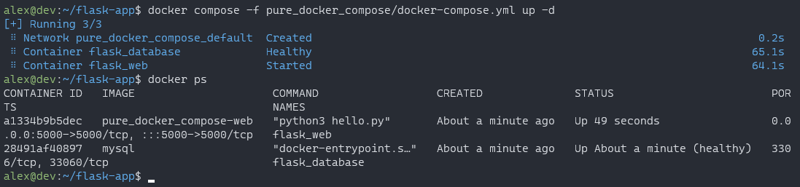
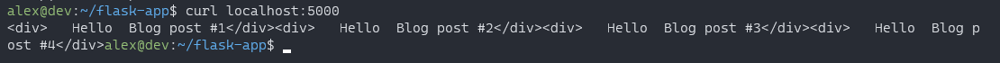
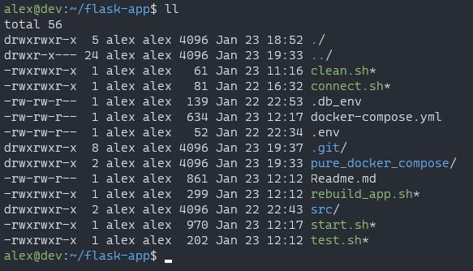
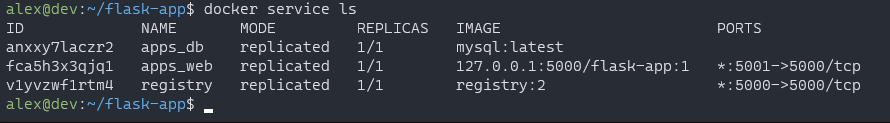
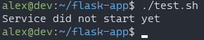
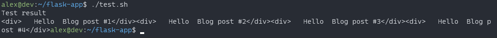
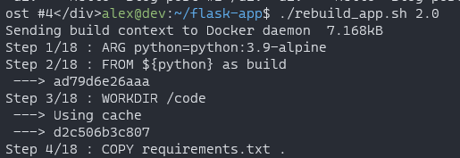
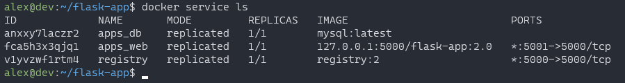
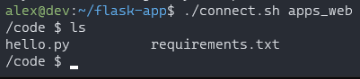
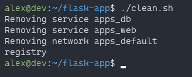

# Flask application with docker compose and swarm

## Docker compose

Команда для запуска docker compose.
```sh
docker compose -f pure_docker_compose/docker-compose.yml up -d
```
<figure>
  
  <figcaption>Запуск docker compose</figcaption>
</figure>

Чтобы проверить работоспособность, воспользуемся утилитой curl.
```
curl localhost:5000
```

<figure>
  
  <figcaption>Результат работы flask приложения</figcaption>
</figure>

## Docker swarm

Команда, чтобы дать разрешения на выполнение для .sh-скриптов.
```sh
chmod +x *.sh
```
<figure>
  
  <figcaption>Командой выданы права на выполнение</figcaption>
</figure>

Команда, чтобы запустить службы docker swarm с помощью файла docker-compose.
```sh
./start.sh
```
<figure>
  
  <figcaption>Запущенный docker swarm</figcaption>
</figure>

Команда, чтобы протестировать развернутое приложение, но придется подождать, пока службы не запустятся.
```sh
./test.sh
```
<figure>
  
  <figcaption>Сервис ещё не готов</figcaption>
</figure>

<figure>
  
  <figcaption>Результат тестирования</figcaption>
</figure>

Команда, чтобы пересобрать приложение. Необходимо указать версию, пример 1.1.
```sh
./rebuild_app.sh <virsion>
```
<figure>
  
  <figcaption>Часть вывода скрипта</figcaption>
</figure>
<figure>
  
  <figcaption>Обновленная версия запущена</figcaption>
</figure>

Команда, чтобы зайти в контейнер.
```sh
./connect.sh
```
<figure>
  
  <figcaption>Результат тестирования</figcaption>
</figure>

Команда, чтобы свернуть приложение и завершить работу локального docker registry.
```sh
./clean
```
<figure>
  
  <figcaption>Завершение и удаление контейнеров</figcaption>
</figure>

