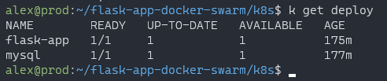
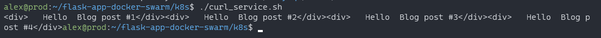
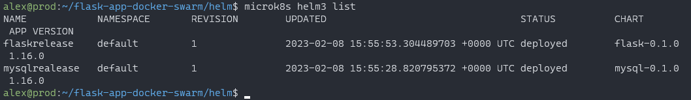

# Flask application with devops tools

## Содержание:

1. [Docker compose](#Docker-compose)
2. [Docker swarm](#Docker-swarm)
3. [Jenkins](#Jenkins)   
   3.1. [Создание проекта и запуск pipeline](#Создание-проекта-и-запуск-pipeline)
4. [Minikube](#Minikube)
5. [Helm](#Helm)

## Docker compose

Команда для запуска docker compose:

```sh
docker compose -f pure_docker_compose/docker-compose.yml up -d
```

<figure>
  
  <figcaption>Запуск docker compose</figcaption>
</figure>

Чтобы проверить работоспособность, воспользуемся утилитой curl:

```
curl localhost:5000
```

<figure>
  
  <figcaption>Результат работы flask приложения</figcaption>
</figure>

## Docker swarm

Команда, чтобы дать разрешения на выполнение для .sh-скриптов:

```sh
chmod +x *.sh
```

<figure>
  
  <figcaption>Командой выданы права на выполнение</figcaption>
</figure>

Команда, чтобы запустить службы docker swarm с помощью файла docker-compose:

```sh
./start.sh
```

<figure>
  
  <figcaption>Запущенный docker swarm</figcaption>
</figure>

Команда, чтобы протестировать развернутое приложение, но придется подождать, пока службы не запустятся:

```sh
./test.sh
```

<figure>
  
  <figcaption>Сервис ещё не готов</figcaption>
</figure>

<figure>
  
  <figcaption>Результат тестирования</figcaption>
</figure>

Команда, чтобы пересобрать приложение. Необходимо указать версию, пример 1.1:

```sh
./rebuild_app.sh <virsion>
```

<figure>
  
  <figcaption>Часть вывода скрипта</figcaption>
</figure>
<figure>
  
  <figcaption>Обновленная версия запущена</figcaption>
</figure>

Команда, чтобы зайти в контейнер:

```sh
./connect.sh
```

<figure>
  
  <figcaption>Результат тестирования</figcaption>
</figure>

Команда, чтобы свернуть приложение и завершить работу локального docker registry:

```sh
./clean.sh
```

<figure>
  
  <figcaption>Завершение и удаление контейнеров</figcaption>
</figure>

## Jenkins

Для запуска необходимо установить:

1. jenkins
2. docker compose
3. java

<figure>
  
  <figcaption>Версии ПО на машине</figcaption>
</figure>

### Создание проекта и запуск pipeline

<figure>
  
  <figcaption>Создание проекта</figcaption>
</figure>

<figure>
  
  <figcaption>Вставляем ссылку на git-репозиторий</figcaption>
</figure>

<figure>
  
  <figcaption>Выбираем ветку</figcaption>
</figure>

<figure>
  
  <figcaption>Страница созданного проекта</figcaption>
</figure>

<figure>
  
  <figcaption>Результат запуска pipeline</figcaption>
</figure>

<figure>
  
  <figcaption>Тестирование приложения</figcaption>
</figure>


Команда, чтобы завершить выполнение docker compose:

```sh
chmod +x stop-jenkins-compose.sh
./stop-jenkins-compose.sh <название проекта>
```

## Minikube

Для запуска необходимо установить:

1. docker
2. docker compose
3. minikube
4. kubectl

Команда, чтобы запустить minikube.

```sh
minikube start
```

<figure>
  
  <figcaption>Запуск minikube</figcaption>
</figure>

Запустить манифесты можно тремя способами:

1. Использовать скрипт start в директории k8s/

Нужна утилита kubectl

```sh
chomod +x start.sh
chomod +x flask/start.sh
chomod +x mysql/start.sh
./start
```

2. Последовательно запустит все манифесты

Нужна утилита kubectl или следующий алиас

```sh
alias kubectl='minikube kubectl --'
```

Последовательность:

```sh
kubectl apply -f mysql/mysql-secret.yaml
kubectl apply -f mysql/mysql-storage.yaml
kubectl apply -f mysql/mysql-deployment.yaml
kubectl apply -f mysql/mysql-service.yaml
kubectl apply -f flask/flask-secret.yaml
kubectl apply -f flask/flask-deployment.yaml
kubectl apply -f flask/flask-service.yaml
```

3. Использовать пакетный менеджер Helm 3

[Рассматривается здесь](#Helm).

Проверим работу способов 1 и 2.   
Получаем доступ к командной строке контейнера с mysql и подключаемся к mysql, используя секретный пароль.
<figure>
  
  <figcaption>mysql deployment</figcaption>
</figure>

<figure>
  
  <figcaption>Show deployments</figcaption>
</figure>

<figure>
  
  <figcaption>Show services</figcaption>
</figure>

Команда для получения доступа к командной строке контейнера

```sh
chmod +x exec.sh
./exec.sh <pod id> <shell>
```

<figure>
  
  <figcaption>Получаем доступ к командной строке контейнера</figcaption>
</figure>

<figure>
  
  <figcaption>Results</figcaption>
</figure>

## Helm

Использовалось:

1. microk8s
2. microk8s dns addon
3. microk8s helm3 | helm

Запуск:  
Работа производится в директории helm  
Запускаем helm chart

```sh
microk8s helm3 install <release name> <chart>
```

или утилитой

```sh
helm install <release name> <chart>
```

<figure>
  
  <figcaption>Запуск mysql chart</figcaption>
</figure>

<figure>
  
  <figcaption>Запуск flask chart</figcaption>
</figure>

<figure>
  
  <figcaption>Список используемых чартов</figcaption>
</figure>

<figure>
  
  <figcaption>Проверка работы подов</figcaption>
</figure>

<figure>
  
  <figcaption>Результаты тестирования</figcaption>
</figure>

<figure>
  
  <figcaption>Завершение работы чарта</figcaption>
</figure>
