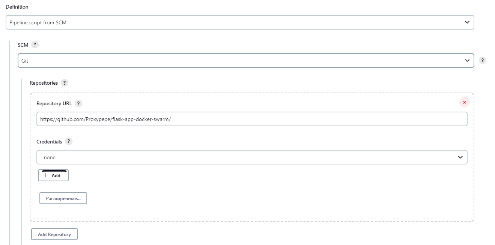
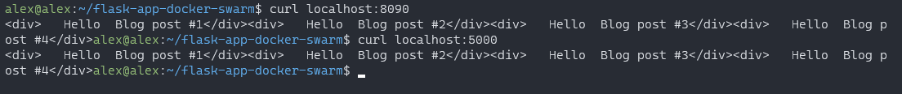

# Flask application with devops tools

## Содержание:
1. [Docker compose](#Docker-compose)
2. [Docker swarm](#Docker-swarm)
3. [Jenkins](#Jenkins)   
  3.1. [Создание проекта и запуск pipeline](#Создание-проекта-и-запуск-pipeline)


## Docker compose

Команда для запуска docker compose:
```sh
docker compose -f pure_docker_compose/docker-compose.yml up -d
```
<figure>
  
  <figcaption>Запуск docker compose</figcaption>
</figure>

Чтобы проверить работоспособность, воспользуемся утилитой curl:
```
curl localhost:5000
```

<figure>
  
  <figcaption>Результат работы flask приложения</figcaption>
</figure>

## Docker swarm

Команда, чтобы дать разрешения на выполнение для .sh-скриптов:
```sh
chmod +x *.sh
```
<figure>
  
  <figcaption>Командой выданы права на выполнение</figcaption>
</figure>

Команда, чтобы запустить службы docker swarm с помощью файла docker-compose:
```sh
./start.sh
```
<figure>
  
  <figcaption>Запущенный docker swarm</figcaption>
</figure>

Команда, чтобы протестировать развернутое приложение, но придется подождать, пока службы не запустятся:
```sh
./test.sh
```
<figure>
  
  <figcaption>Сервис ещё не готов</figcaption>
</figure>

<figure>
  
  <figcaption>Результат тестирования</figcaption>
</figure>

Команда, чтобы пересобрать приложение. Необходимо указать версию, пример 1.1:
```sh
./rebuild_app.sh <virsion>
```
<figure>
  
  <figcaption>Часть вывода скрипта</figcaption>
</figure>
<figure>
  
  <figcaption>Обновленная версия запущена</figcaption>
</figure>

Команда, чтобы зайти в контейнер:
```sh
./connect.sh
```
<figure>
  
  <figcaption>Результат тестирования</figcaption>
</figure>

Команда, чтобы свернуть приложение и завершить работу локального docker registry:
```sh
./clean.sh
```
<figure>
  
  <figcaption>Завершение и удаление контейнеров</figcaption>
</figure>

## Jenkins

Для запуска необходимо установить:
1. jenkins
2. docker compose
3. java

<figure>
  
  <figcaption>Версии ПО на машине</figcaption>
</figure>

### Создание проекта и запуск pipeline

<figure>
  
  <figcaption>Создание проекта</figcaption>
</figure>

<figure>
  
  <figcaption>Вставляем ссылку на git-репозиторий</figcaption>
</figure>

<figure>
  
  <figcaption>Выбираем ветку</figcaption>
</figure>

<figure>
  
  <figcaption>Страница созданного проекта</figcaption>
</figure>

<figure>
  
  <figcaption>Результат запуска pipeline</figcaption>
</figure>

<figure>
  
  <figcaption>Тестирование приложения</figcaption>
</figure>


Команда, чтобы завершить выполнение docker compose:
```sh
chmod +x stop-jenkins-compose.sh
./stop-jenkins-compose.sh <название проекта>
```
